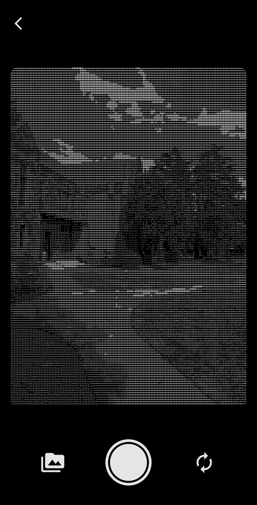
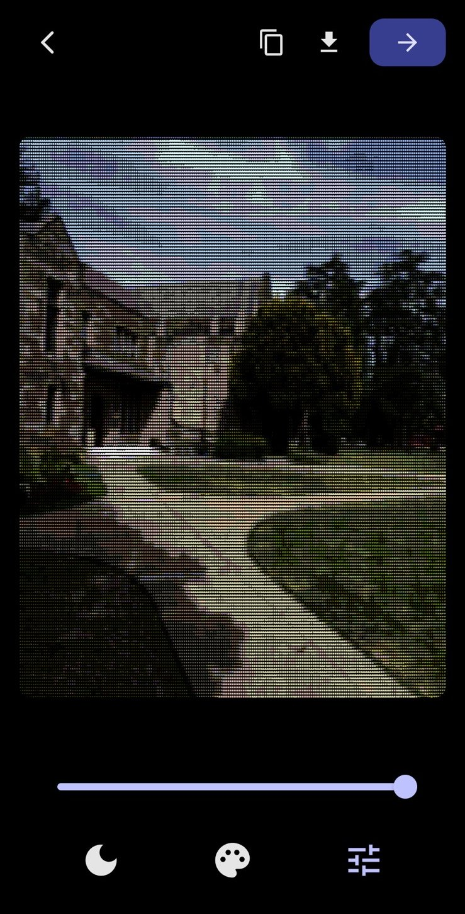
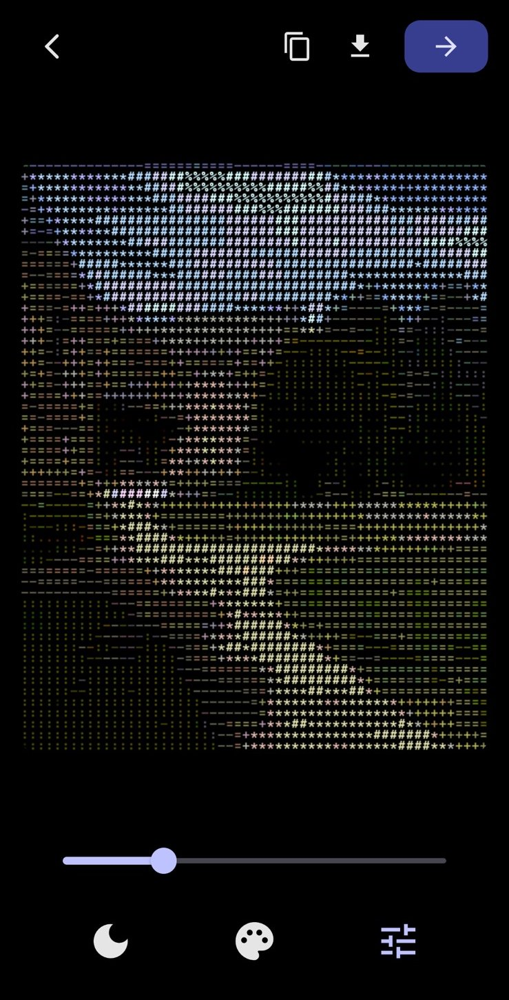

# image_to_ascii

Convert images or camera output to ASCII art in real-time.

  

## Usage

### Real-time camera preview

```dart
import 'package:image_to_ascii/image_to_ascii.dart';

// Create camera controller
final controller = AsciiCameraController();
await controller.initialize();

// Display live ASCII using StreamBuilder
StreamBuilder(
  stream: controller.stream,
  builder: (context, snapshot) {
    if (snapshot.hasData) {
      return AsciiImageWidget(
        ascii: AsciiImage.fromSimpleString(snapshot.data!),
      );
    }
    return CircularProgressIndicator();
  },
)

// Control flash
await controller.flashOn();
await controller.flashOff();
await controller.flashAuto();

// Switch cameras
await controller.switchToFront();
await controller.switchToBack();

// Take a picture and convert to ASCII
final picture = await controller.takePicture();
// Then pass to convertImagePathToAscii()

// Dispose when done
await controller.dispose();
```

### Convert image to ASCII

```dart
import 'package:image_to_ascii/image_to_ascii.dart';

// Convert image file to ASCII
final asciiImage = await convertImagePathToAscii('path/to/image.png');

// Or convert a ui.Image directly
final asciiImage = await convertImageToAscii(uiImage);

// Display
AsciiImageWidget(ascii: asciiImage)
```

### Options

- `width` / `height` - Set output dimensions (density)
- `dark` / `darkMode` - Invert colors (white text on black)
- `color` - Enable colored ASCII output

```dart
AsciiCameraController(
  darkMode: true,
  width: 150,
);

convertImagePathToAscii(
  'image.png',
  width: 100,
  dark: true,
  color: true,
);
```

## Linux desktop

Linux desktop needs extra setup because the official `camera` plugin has no Linux implementation, and the file picker relies on GTK system libraries.

### App dependencies

Add `camera_desktop` to your app's `pubspec.yaml`:

```yaml
dependencies:
  image_to_ascii: ^0.0.1
  camera_desktop: ^1.1.7
```

### System dependencies

Install these packages to build and run on Linux:

- `gstreamer`
- `gst-plugins-base`
- `gst-plugins-good`
- `gtk3`
